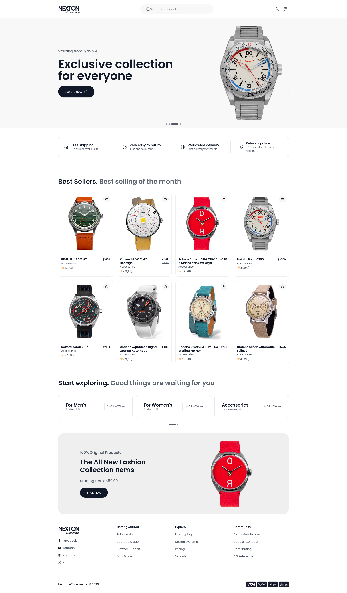
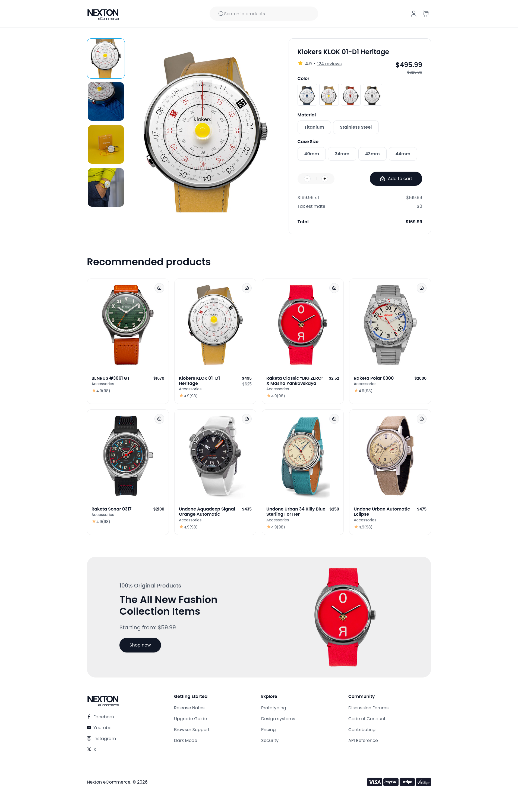
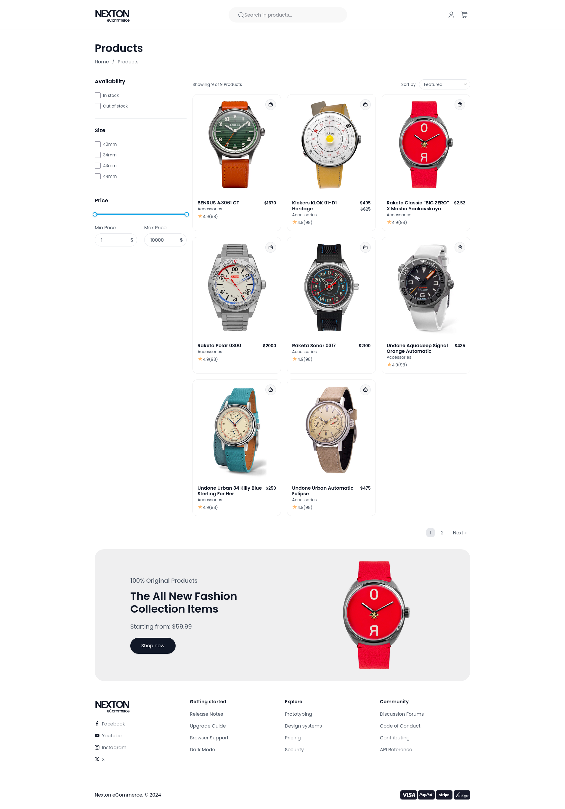
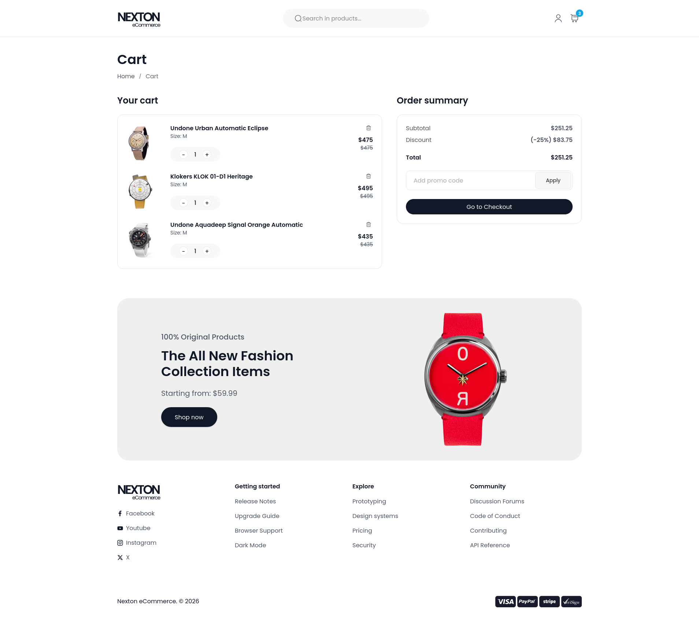

# Nexton

Ecommerce Website Template A modern e-commerce watch store built with HTML, Tailwind CSS, and vanilla JavaScript(Web Components).

## Preview

[Preview](https://nexton-html.netlify.app/)

## Pages

- [**Home**](https://nexton-html.netlify.app/) — Hero section, featured categories, new arrivals, and customer reviews
- [**Product**](https://nexton-html.netlify.app/klokers-klok-01-d1-heritage-klok-01-d1.html) — Browse products by category with filters
- [**Collection**](https://nexton-html.netlify.app/collection) — Product detail page with image gallery and size selector
- [**Cart**](https://nexton-html.netlify.app/cart) — Shopping cart with order summary

## Screenshots

### Homepage

### Product

### Collection

### Cart

## Tech Stack

- HTML5
- [Tailwind CSS v4](https://tailwindcss.com/)
- [Vanilla JavaScript(Web Components)](https://www.webcomponents.org/)
- [Splide.js](https://splidejs.com/) — Carousel
- [GSAP](https://gsap.com/) — Animations
